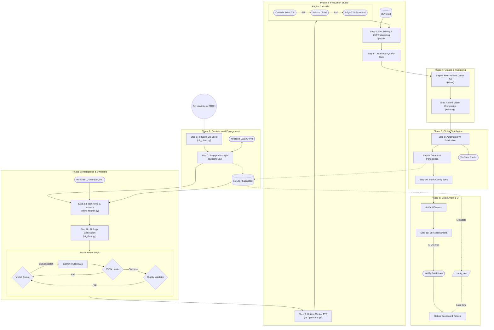

# System Architecture — Echo FM

Echo FM is an **autonomous, serverless media pipeline**. It is engineered to operate with zero persistent server overhead, utilizing discrete cloud services and high-tier AI reasoning to produce professional satirical radio broadcasts on a periodic schedule.

## 🛰️ Detailed Data Flow (High-Fidelity Pipeline)

Echo FM utilizes a multi-phase, state-aware production loop. Every stage is designed for maximum resilience and data integrity.

## 🏗️ Shape Legend

| Shape | Mermaid Syntax | Meaning |
| :--- | :--- | :--- |
| Cylinder | `[(text)]` | Persistent data store |
| Diamond | `{text}` | Decision / Gate Check |
| Stadium | `(["text"])` | External API or Service |
| Parallelogram| `[/"text"/]` | Data artifact / File on disk |
| Rectangle | `[text]` | General processing node |

## 🧠 Technical Design Principles

### 1. Unified Master Engine (Narration Consistency)
Echo FM maintains vocal consistency by selecting a **Single Master Engine** per broadcast. If a premium engine (Cartesia) fails mid-episode, the system **wipes all partial audio segments** and restarts the entire narration from segment 1 using the next tier (Kokoro or Edge-TTS). This prevents jarring shifts in audio quality within a single show.

### 2. Resilience & Retry Logic
The system is designed to "fail forward" through multiple layers:
- **AI Synthesis Retry:** If the primary LLM fails validation (word count, JSON structure), the system retries once more. If both fail, it moves to the next model in the prioritized **Smart Router** queue.
- **JSON Healer:** A custom recursive brace-walking algorithm repairs truncated AI responses, ensuring that transient token limits don't break the pipeline.

### 3. Audio Engineering (The Mixer)
The `tts_generator.py` and `main.py` collaborate to produce radio-quality audio:
- **SFX Priority:** Scripts define `sfx_pre` and `sfx_post` (stings, applause, laugh tracks) which are mixed with precision timing.
- **Atmospheric Looping:** Field reports automatically trigger a `-22dB STREET_AMBIENT` loop mixed behind the narrator.
- **Mastering:** The final assembly undergoes a **Loudness Normalization Pass** (Target: -14 LUFS) to ensure professional streaming volume consistency.

### 4. Behavioral Divergence (Local vs Production)

The system behavior is strictly controlled by the `--env` flag:

| Feature | Local Development (`--env local`) | Production Broadcast (`--env production`) |
| :--- | :--- | :--- |
| **Database** | SQLite (`ai_radio_dev.db`) | Supabase Cloud |
| **AI News Context** | Filtered / Cached Headlines | 20+ Real-time Global Headlines |
| **TTS Engine** | Standard `edge-tts` (Free) | Premium `Cartesia` / `Kokoro` |
| **Cover Art** | FFmpeg simple color | Pixel-Perfect Pillow (PIL) Overlays |
| **Publishing** | `output/` folder only | YouTube Data API v3 |
| **UI Updates** | Local `config.json` sync | Netlify Webhook Rebuild |

## 🔗 Serverless UI Synchronization
The app is 100% serverless. The UI is a static frontend refreshed via webhooks:
1. **Telemetry Loop:** Every production run starts with **Step 0: YouTube Engagement Sync**. The system fetches real-time metrics for all previous broadcasts, ensuring the dashboard stats are updated by the start of the next run.
2. **Pipeline Completion:** Once the MP4 is uploaded and the DB record is saved, `sync_config.py` runs.
3. **Build Hook:** The pipeline sends a POST request to a **Netlify Build Hook**.
4. **Redeploy:** Netlify re-clones the repo, fetches the latest metadata, and redeploys the **Station Control** UI with the new broadcast visible instantly.
