# AI Radio — Echo: System Architecture

This diagram uses **Mermaid.js** syntax to visualize the data flow of the Echo broadcast suite.

```mermaid
graph TD
    %% Data Sources
    subgraph Ingestion [1. Ingestion & Filtering]
        RSS[RSS Feeds: BBC, Reuters, Guardian] --> NF[news_fetcher.py]
        HN[HackerNews API] --> NF
        NF -->|Deduplication: Threshold-2 Overlap| DB[(SQLite / Supabase)]
    end
%% AI Core
subgraph Brain [2. AI Satirical Engine]
    DB -->|Context & Past Jokes| AC[ai_client.py]
    AC --> REAL_SWITCH{is_real_run?}

    REAL_SWITCH -->|Yes / Premium| PROD_LOGIC[Full Context: 15 News / 20 Mem]
    PROD_LOGIC --> SET_A[Set A: 6-Tier Resilient Queue]
    SET_A -->|Llama 70B / Scout / Gemini 3.5 / Flash-Lite / Qwen / Pro| SET_A_OUT

    REAL_SWITCH -->|No / Shielded| LOCAL_LOGIC[Trimmed Context: 3 News / 1 Mem]
    LOCAL_LOGIC --> SET_B[Set B: 5-Tier Fast Queue]
    SET_B -->|Gemini 3.5 / 3.1 / 2.5 / 2.0 / 1.5| SET_B_OUT

    SET_A_OUT & SET_B_OUT -->|Raw Output| OBS[Observability: Deep Logging]
    OBS --> HEAL[JSON Healer / String Repair]
    HEAL --> QUAL{Is Good?}
    QUAL -->|No| ABORT[Abort: Code 1]
    QUAL -->|Yes| MASTER_FLOW[Cleaned Script]
end

%% Media Generation
subgraph Mastering [3. Media Mastering]
    MASTER_FLOW --> TTS[tts_generator.py]
    TTS --> TTS_SWITCH{is_real_run?}

    TTS_SWITCH -->|Yes| RPD_CHECK{Within RPD Limit?}
    RPD_CHECK -->|Yes| GROQ_TTS[Groq Cloud: Orpheus v1]
    RPD_CHECK -->|No / Exhausted| GOOGLE_TTS[Google Cloud: Neural2]
    
    GROQ_TTS -->|429 Rate Limit / Error| GOOGLE_TTS

    TTS_SWITCH -->|No| EDGE_TTS[Microsoft Edge: Local]
        GROQ_TTS & GOOGLE_TTS & EDGE_TTS --> AUD[Audio Master .mp3]

        MASTER_FLOW -->|Visual Description| ART[Flux Model: Pollinations]
        ART -->|Neural Art| IMG[Background .png]

        AUD & IMG --> FF[FFmpeg Orchestrator]
        FF --> VIDEO[Final Broadcast .mp4]
        VIDEO --> DUR{Duration >= 600s?}
        DUR -->|No| ABORT
        DUR -->|Yes| GRID_FLOW
    end
    %% Distribution & Dashboard
    subgraph Grid [4. Distribution & Display]
        DUR -->|Yes| GRID_FLOW[Approved Episode]
        GRID_FLOW --> DIST_ENV{env == 'production'?}
        
        DIST_ENV -->|Yes| YT[YouTube Upload]
        DIST_ENV -->|Yes| BKY[Bluesky Post]
        
        DIST_ENV -->|No| LOCAL_OUT[./output/ Folder]
        DIST_ENV -->|No| MOCK[Mock Socials]
        
        YT & LOCAL_OUT --> DB_WRITE[Save to DB]
        DB_WRITE --> DB[(SQLite / Supabase)]
        
        DB -->|sync_config.py| CFG[config.js]
        CFG --> APP[app.js]
        
        LOCAL_OUT -->|HTML5 Player| APP
        YT -->|IFrame API| APP
        APP --> UI[Neon-Glass Dashboard]
    end

    %% Styling
    style Ingestion fill:#1a1a1a,stroke:#00f2ff,color:#fff
    style Brain fill:#1a1a1a,stroke:#7000ff,color:#fff
    style Mastering fill:#1a1a1a,stroke:#ff00ea,color:#fff
    style Grid fill:#1a1a1a,stroke:#00ff40,color:#fff
    style REAL_SWITCH fill:#333,stroke:#fff
    style TTS_SWITCH fill:#333,stroke:#fff
    style DIST_ENV fill:#333,stroke:#fff
    style GRID_FLOW fill:#333,stroke:#fff
    style DUR fill:#ff0000,stroke:#fff
    style QUAL fill:#333,stroke:#fff
    style RPD_CHECK fill:#333,stroke:#fff
```

---

## 🌍 Environment Logic Summary

| Feature | Production (Cloud) | Staging (Cloud) | Local (Shielded) |
| :--- | :--- | :--- | :--- |
| **Trigger** | GitHub Actions | Manual CLI | Manual CLI |
| AI Brain | Set A: 6-Tier Resilient (Llama/Scout/Gemini/Qwen) | Set B: 5-Tier Fast (Gemini Flash) | Set B: 5-Tier Fast (Gemini Flash) |
| **Context** | 15 News (T1) / 8 News (T2) | 3 News / 1 Memory | 3 News / 1 Memory |
| **Speech** | Set A: 3-Tier (Orpheus / Google / Edge) | Set B: 1-Tier (Edge-TTS) | Set B: 1-Tier (Edge-TTS) |

| **Database** | Supabase (Prod) | Supabase (Dev) | SQLite (Local) |
| :--- | :--- | :--- | :--- |
| **Video** | YouTube Upload | Mock (Rick Astley) | Local File |
| **Socials** | Bluesky Live | Mocked | Mocked |
| **Quality** | >600s Duration | >200s Duration | >200s Duration |

---

## 🧪 Testing & Verification

The system uses a decoupled verification strategy to balance speed and rigor:

1.  **Lightweight Health Check (`npm run verify`):**
    *   **Scope:** Imports, API connectivity, schema sync, environment variables.
    *   **Speed:** < 10 seconds.
    *   **Logic:** Uses mocks for AI generation to avoid token costs.
2.  **Heavy Integration Suite (`npm run test:integration`):**
    *   **Scope:** Full pipeline dry-run, FFmpeg rendering, end-to-end artifact validation.
    *   **Speed:** 2-5 minutes.
    *   **Logic:** Executes `main.py --dry-run` to ensure the entire system is technically sound.

---

## 🛠️ Core Behavioral Mandates

The Echo system adheres to several "unwritten" rules that ensure the broadcast remains high-quality and the pipeline stays resilient:

1.  **JSON Resilience (The Healer):** The `ai_client.py` implements a state-aware machine to close open strings and brackets. If an LLM is cut off, the system "heals" the JSON to ensure the broadcast can still play.
2.  **Persona Integrity:** Echo (Host) and Glitch (Correspondent) are banned from using professional titles. Their dynamic is purely argumentative and rhythmic.
3.  **Forward Momentum:** Each segment must introduce new information. Restating previous segments is a hard logic failure that the AI is commanded to avoid.
4.  **Deduplication Anchor:** The system never "forgets." It tracks original news headlines to ensure that even if the AI changes the show title, the underlying story is never repeated.

